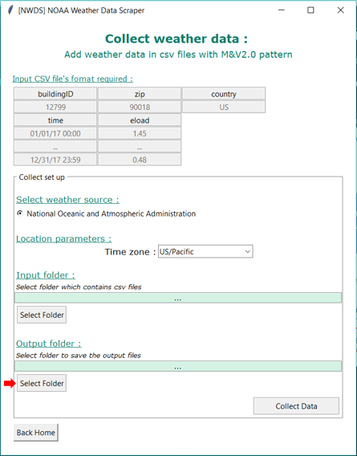

# **NOAA WEATHER DATA SCRAPER**
_________________________________________________

### 1. Introduction

The NOAA Weather Data Scraper (NWDS) is a tool for collecting historical outside air temperature data from [National Oceanic and Atmospheric Administration (NOAA)](https://www.noaa.gov/). The data is gathered from the [National Centers for Environmental Information](https://www.ncei.noaa.gov)'s FTP server, which contains past weather data for 5109 weather stations across the USA.

The tool can be used either through Graphical User Interface or Command Lines and there is two options for data gathering:

 * **Option 1:** Collect hourly weather data for a specific zip code and time period
 * **Option 2:** Collect hourly weather data for one or several buildings that are charachterized by csv files, which contain the zip code of the building and the specific timestamps for which temperature values are to be collected.  Basically the tool will scan the csv files in a specified folder to collect the required information.

### 2. Installation 

- Python version required : 3.6 or more recent

> https://www.python.org/downloads/ 

- Library/modules required:

| Library/module | Version (or more recent) |
|----------------|-------------------------:|
|numpy           |1.14.3                    |
|pandas          |0.23.0                    |
|matplotlib      |2.2.2                     |
|datetime        |2.7.3                     |
|time            |2.7.3                     |
|requests        |2.18.4                    |
|platform        |1.0.8                     |
|geocoder        |1.38.1                    |
|argparse        |1.1                       |
|pytz            |2018.4                    |
|os              |                          |
|math            |                          |
|tkinter         |                          |
|threading       |                          |

- Install git :
    - If you have Anaconda you can open a Terminal and execute the following command:
    
    > conda install git
    
    - Or you can find the instruction to install it on https://www.atlassian.com/git/tutorials/install-git

- Install NWDS modules :
    - Open a Terminal
    - Execute the commands :
    > git clone https://github.com/LBNL-ETA/NWDS.git  
    > cd NWDS  
    > python setup.py install  

### 3. User guide
#### **NWDS using the Graphical User Interface :** 
- **Launch the GUI on Mac :**
    1. Open a Terminal :  
        Finder > Applications > Utilities > Terminal
    2. Execute the following commands :
        > cd NWDS  
        > cd noaa_weather_data_scraper 
        > python GUI.py

- **Launch the GUI on Windows :**
    1. Open a Terminal
        - Clic on Windows icon (left-bottom)
        - Write "cmd" and press "Enter" 
    2. Execute the follwing commands:
        > cd NWDS  
        > cd noaa_weather_data_scraper  
        > python GUI.py

- **Get data for one specific zip code and time period :**
1. Open the GUI
2. Open mode "One zip code and specific time period"

3. Clic on the weather data source NOAA:

4. Indicate the time period and zone:
    - First date : The time period starting date (mm/dd/yy H:M)
    - Last date : The time period finish date (mm/dd/yy H:M)
    - Time zone : Select the time zone of the location

    

5. Define a location:
    - Country : Complete name or acronym (US, USA, United States, United States of America)
    - zip code

    

6. Select the output folder (Folder where the weather data file will be save):

    

7. Launch the data collection process:

    

8. Wait while the algorithm is processing:

    

9. Wait until the process is complete:

    
    
    - The ouput file contains the weather data

- **Get data for several zip code and RMV2.0 pattern file :**

1. Open GUI
2. Open mode "Add weather data in csv files with RM&V2.0 pattern":

    

3. Set up files with the required format and save them in a folder (which is the "input folder"):

    - Specific format :

    

    - Specific format in Excel :

    

4. Select the NOAA's weather data source and the time zone of your study:

    

5. Select the input folder which contains every files with the required format:

    

6. Select the output folder which will contains the files with the weather data:

    

7. Launch the data collection process:

    

8. Wait until the process is complete:

    

#### NWDS using command lines:

The following present how one can use directly the tool using command lines.
    
List of arguments:

| **Argument**  |**Command** |     **Example**    |
|---------------|--------:|--------------------:|
| mode          | -m      | zip or rmv2.0       |
| first date    | -fd     | 01/01/18 00:00      |
| last date     | -ld     | 11/17/18 00:00      |
| time zone     | -tz     | US/Pacific          |
| country       | -cty    | USA                 |
| zip code      | -zip    | 94720               |
| Input folder  | -if     | C:/.../input_data/  |
| Output folder | -of     | C:/.../output_data/ |       

- **Get data for one specific zip code and time period:**

Execute the following commands:

> cd noaa_weather_data_scraper

> python nwds.py -m zip -fd [first date] -ld [last date] -tz [time zone] -cty [country] -zip [zip code] -of "[output folder]"

Example :

> python nwds.py -m zip -fd 01/01/17 00:00 -ld 01/01/18 00:00 -tz US/Pacific -cty USA -zip 94720 -of "C:/.../my_output_folder" 

- **Get data for several buildings:**

Execute the following commands:

> cd noaa_weather_data_scraper

> python nwds.py -m rmv2.0 -tz [time zone] -if "[input folder]" -of "[output folder]"

Example :

> python nwds.py -m rmv2.0 -tz US/Pacific -if "C:/.../my_input_folder" -of "C:/.../my_output_folder".
